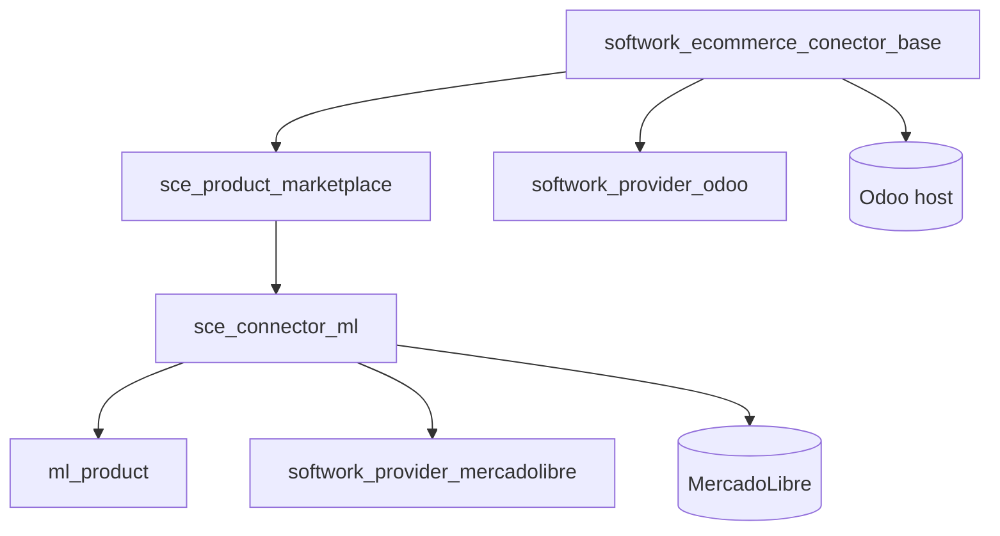
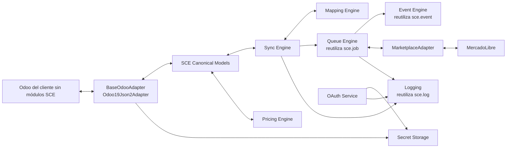
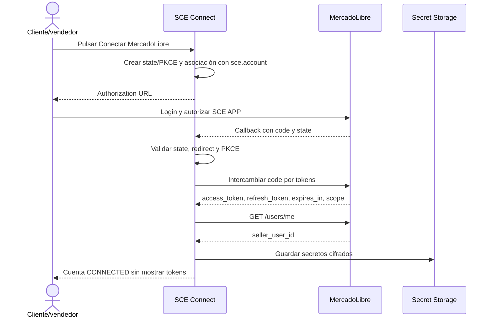
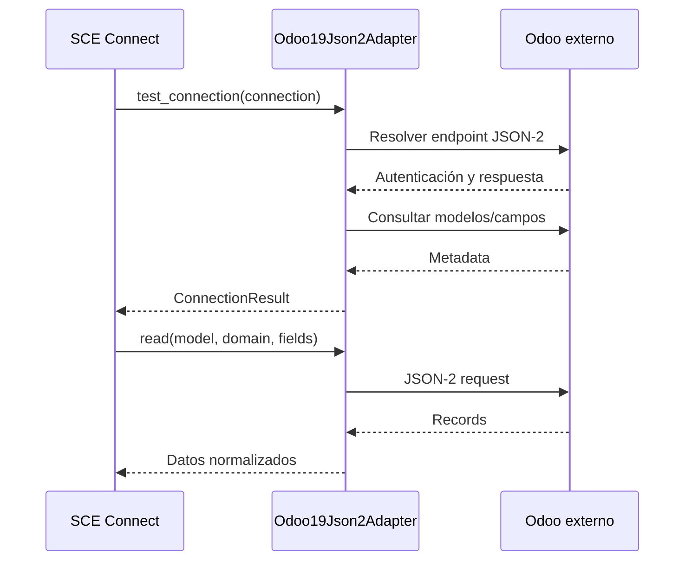
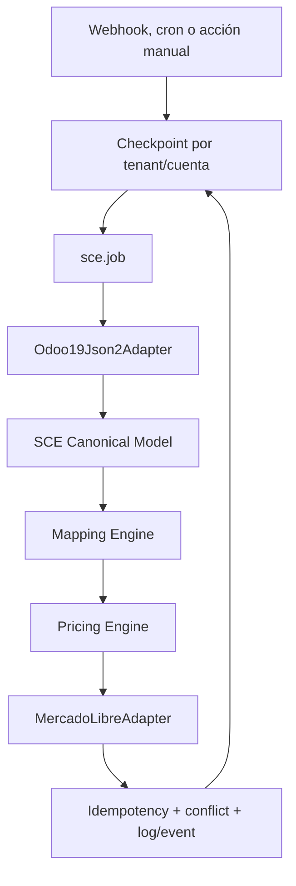

# SCE Connect: auditoría técnica y propuesta de arquitectura

**Fecha:** 2026-08-27  
**Estado:** Fase 0 completada. No se inició la Fase 1.  
**Alcance:** auditoría de solo lectura del repositorio `marketplace_connector`.

## 1. Resumen ejecutivo

El repositorio ya contiene un núcleo SCE funcional para operar dentro de un Odoo host:

- `sce.connector` y `sce.account` para conectores y cuentas.
- `sce.job` para cola, reintentos y ejecución asíncrona.
- `sce.event` y `sce.log` para eventos y trazabilidad.
- `ProviderFactory` e `IProvider` para providers extensibles.
- OAuth MercadoLibre con PKCE, callback y refresh token.
- Transporte HTTP de MercadoLibre con timeout y retry ante 401/403.
- Publicaciones, mappings, órdenes y sincronización de marketplace.
- Provider MercadoLibre activo en `sce_connector_ml`, con fallback legacy controlado.
- Provider Odoo existente basado en XML-RPC.
- Cron de health check, cola, retries, limpieza, tokens y snapshots.

La arquitectura actual **no es todavía SCE Connect middleware**. Sus modelos y servicios viven en Odoo y sus credenciales son campos de `sce.account`. Para soportar Odoo externo sin instalar módulos allí, se necesita agregar una capa de conexión/adaptación remota y modelos canónicos, manteniendo el core y el connector MercadoLibre existentes.

La prioridad técnica antes de producción multi-tenant es proteger secretos, aislar tenants/empresas, resolver concurrencia e incorporar tests.

## 2. Arquitectura actual encontrada



### Módulos

| Módulo | Responsabilidad actual | Observación |
|---|---|---|
| `softwork_ecommerce_conector_base` | Kernel SCE: accounts, connectors, jobs, events, logs, subscriptions, OAuth controllers y cron | Reutilizable como base, pero diseñado para datos locales de Odoo |
| `sce_product_marketplace` | Publicaciones, mappings, órdenes y jobs marketplace genéricos | Buena base para idempotencia y publicaciones |
| `sce_connector_ml` | Modelos, wizards, OAuth/HTTP y provider específico de MercadoLibre | Connector activo que debe reutilizarse |
| `ml_product` | Compatibilidad y migración legacy de `product.template` | No debe extenderse para SCE Connect |
| `softwork_provider_mercadolibre` | Wrapper externo del provider ML | Útil durante transición, pero duplica superficie de resolución |
| `softwork_provider_odoo` | Provider Odoo→Odoo vía XML-RPC | No es todavía un adapter remoto JSON-2 para SCE Connect |

### Componentes existentes reutilizables

- [provider_interface.py](../marketplace_connector/addons/softwork_ecommerce_conector_base/services/provider_interface.py): contrato `IProvider`.
- [provider_factory.py](../marketplace_connector/addons/softwork_ecommerce_conector_base/services/provider_factory.py): resolución externa, fallback por convención y fallback legacy.
- [sce_account.py](../marketplace_connector/addons/softwork_ecommerce_conector_base/models/sce_account.py): cuentas, OAuth, estados y configuración actual.
- [sce_job.py](../marketplace_connector/addons/softwork_ecommerce_conector_base/models/sce_job.py): cola, estados, reintentos y cron.
- [sce_event.py](../marketplace_connector/addons/softwork_ecommerce_conector_base/models/sce_event.py): eventos de integración.
- [sce_log.py](../marketplace_connector/addons/softwork_ecommerce_conector_base/models/sce_log.py): almacenamiento de logs técnicos.
- [log_service.py](../marketplace_connector/addons/softwork_ecommerce_conector_base/services/log_service.py): servicio centralizado de logging.
- [publication_service.py](../marketplace_connector/addons/sce_product_marketplace/services/publication_service.py): enqueue, publicaciones, webhooks e importación idempotente de órdenes.
- [http_transport.py](../marketplace_connector/addons/sce_connector_ml/services/http_transport.py): transporte HTTP ML con timeout y refresh ante autorización vencida.
- [oauth.py](../marketplace_connector/addons/sce_connector_ml/services/oauth.py): OAuth ML desacoplado.
- [ml_provider.py](../marketplace_connector/addons/sce_connector_ml/services/ml_provider.py): implementación MercadoLibre activa.
- [webhook.py](../marketplace_connector/addons/softwork_ecommerce_conector_base/controllers/webhook.py): endpoint genérico de webhook existente.
- [api_connect.py](../marketplace_connector/addons/softwork_ecommerce_conector_base/controllers/api_connect.py): endpoints actuales de diagnóstico/API.
- [sce_odoo_migration.py](../marketplace_connector/addons/softwork_ecommerce_conector_base/models/sce_odoo_migration.py): evidencia reutilizable de acceso remoto Odoo vía XML-RPC, aunque con otro propósito.

## 3. Arquitectura SCE Connect propuesta

SCE Connect debe ser una nueva capacidad del mismo producto, con un límite claro entre el host SCE y los sistemas externos:



### Principios

1. El Odoo del cliente solo expone su API existente; no se instala ni modifica código.
2. SCE conserva la identidad interna mediante una cuenta/conexión propia; nunca usa solo el ID externo como clave.
3. Los adapters encapsulan JSON-2 y cualquier futura versión de Odoo.
4. Los modelos canónicos desacoplan Odoo y MercadoLibre.
5. El connector ML existente se adapta a `MarketplaceAdapter`; no se crea un segundo connector.
6. La cola y el logging existentes se extienden, no se duplican.
7. Los secretos se almacenan mediante una abstracción de secret storage y no se muestran ni se escriben en logs.

## 4. Flujo OAuth MercadoLibre



La aplicación MercadoLibre será propiedad de SoftWork/SCE. El cliente no debe proporcionar Client ID, Client Secret, contraseña, access token ni refresh token. La configuración de la aplicación y el redirect URI son responsabilidad operativa de SCE.

### Refresh y desconexión

- Un único servicio detectará expiración o respuesta 401/403.
- El refresh debe usar locking por cuenta para evitar renovaciones simultáneas.
- Debe persistir el nuevo refresh token cuando MercadoLibre lo rote.
- El estado debe pasar a `AUTH_REQUIRED` solo si ML invalida la autorización.
- Desconectar debe cancelar jobs pendientes, invalidar/eliminar secretos y conservar logs sanitizados.
- Debe agregarse una operación de revoke si la API de MercadoLibre la soporta; si no, documentar la invalidación local.

## 5. Flujo API de Odoo externo



El adapter debe aceptar URL, database, usuario, API key, versión y timeout. Debe validar URL con allowlist/política SSRF, exigir HTTPS salvo una excepción explícita de desarrollo y clasificar errores como `AUTHENTICATION_ERROR`, `PERMISSION_ERROR`, `DATABASE_ERROR`, `NETWORK_ERROR` o `API_ERROR`.

## 6. Modelos nuevos propuestos

Los nombres son propuestas para revisión, no código iniciado:

### Conexión y tenants

- `sce.tenant`: cliente lógico de SCE, separado de `res.company` del Odoo host.
- `sce.external.connection`: conexión a Odoo externo, con URL, database, usuario, versión, adapter y estado.
- `sce.secret`: referencia a secretos cifrados, con tipo, propietario, rotación y metadatos no sensibles.
- `sce.marketplace.account`: asociación tenant/connection/provider/seller; puede extender o reemplazar progresivamente la semántica actual de `sce.account` sin romper compatibilidad.

### Configuración

- `sce.sync.profile`: modo (`full`, `incremental`, `manual`, `automatic`), frecuencia y alcance.
- `sce.mapping`: regla configurable de origen, destino, conversión y valor por defecto.
- `sce.pricing.rule`: regla global, por cuenta, categoría, producto, marca o listing type.
- `sce.conflict`: conflicto detectado, política aplicada, origen, destino y resolución.

### Canonical models

- `sce.canonical.product`
- `sce.canonical.variant`
- `sce.canonical.stock`
- `sce.canonical.price`
- `sce.canonical.order`
- `sce.canonical.customer`
- `sce.canonical.warehouse`
- `sce.canonical.publication`

Cada entidad debe incluir una identidad SCE estable y mappings externos idempotentes. No debe depender únicamente de IDs locales de Odoo.

## 7. Servicios nuevos propuestos

- `BaseOdooAdapter`: contrato de lectura, escritura, metadata y test de conexión.
- `Odoo19Json2Adapter`: primera implementación concreta.
- `OdooConnectionService`: validación, health check y clasificación de errores.
- `OdooMetadataDiscoveryService`: modelos, campos, relaciones y capacidades.
- `CanonicalSyncService`: traducción adapter ↔ modelos canónicos.
- `MappingService`: resolución de campos, relaciones, conversiones y defaults.
- `PricingEngine`: composición de costo, margen, comisión, financiación, envío e impuestos.
- `SyncEngine`: full/incremental/manual/automatic y checkpoints.
- `SecretStorage`: cifrado, lectura controlada, rotación y redacción.
- `TenantIsolationService`: autorización y contexto por tenant/empresa.
- `IdempotencyService`: claves y deduplicación para productos, órdenes, stock, precios y webhooks.
- `MarketplaceAdapter`: contrato agnóstico de marketplace que envuelve el provider actual.

## 8. Adapters

### Odoo

```text
BaseOdooAdapter
└── Odoo19Json2Adapter
```

No implementar Odoo 17/18 hasta que una necesidad real lo justifique. El provider XML-RPC actual se conserva para compatibilidad/migración, pero no debe ser la API principal de SCE Connect Odoo 19.

### Marketplace

```text
MarketplaceAdapter
├── MercadoLibreAdapter  -> reutiliza sce_connector_ml / IProvider
├── TiendanubeAdapter    -> futuro
└── ShopifyAdapter       -> futuro
```

La conversión entre `IProvider` y `MarketplaceAdapter` debe estar en una capa de compatibilidad, no dispersa por jobs o modelos canónicos.

## 9. Componentes que se reutilizan

| Necesidad | Componente existente | Estrategia |
|---|---|---|
| Jobs/queue | `sce.job`, `sce_job_marketplace.py`, cron | Extender tipos y mejorar locking/backoff |
| Logs | `sce.log`, `log_service.py` | Reutilizar y sanitizar payloads |
| Eventos | `sce.event` | Agregar eventos de conexión, metadata y sync |
| Provider resolution | `ProviderFactory`, `IProvider` | Mantener contrato y agregar adapter marketplace |
| MercadoLibre | `sce_connector_ml` | Reutilizar OAuth, HTTP y provider activo |
| Publicaciones | `marketplace.publication` | Conectar con canonical publication/mappings |
| Órdenes | `publication_service.py`, `marketplace.sale.order` | Mantener importación idempotente y ampliar adapter Odoo |
| Configuración | `sce.connector`, `sce.account` | Extender gradualmente con compatibilidad |
| Diagnóstico | `api_connect.py`, wizard de status | Reutilizar clasificación y UI donde aplique |

## 10. Archivos existentes candidatos a modificar

No se modifican en Fase 0. Después de aprobar la arquitectura, los cambios iniciales deberían concentrarse en:

- `softwork_ecommerce_conector_base/__manifest__.py`, para registrar nuevos archivos del core si SCE Connect vive allí.
- `softwork_ecommerce_conector_base/models/sce_account.py`, solo para compatibilidad/relación con conexión externa y estados, evitando otra migración destructiva.
- `softwork_ecommerce_conector_base/models/sce_job.py`, para locking, tenant context y nuevos tipos.
- `softwork_ecommerce_conector_base/models/sce_event.py` y `sce_log.py`, para eventos y sanitización.
- `softwork_ecommerce_conector_base/controllers/api_connect.py`, para endpoints de conexión de Odoo externo.
- `softwork_ecommerce_conector_base/controllers/oauth.py`, para robustecer state/tenant y el flujo multi-vendedor.
- `softwork_ecommerce_conector_base/controllers/webhook.py`, para routing multi-tenant, rate limiting y validación.
- `softwork_ecommerce_conector_base/data/ir_cron.xml`, solo para registrar tareas nuevas o ajustar intervalos.
- `sce_connector_ml/services/oauth.py` y `http_transport.py`, únicamente si el secret storage/locking exige una integración mínima.
- `sce_product_marketplace/services/publication_service.py`, para enrutar por canonical models sin duplicar publicación/importación.
- Vistas y CSV de seguridad de los módulos afectados, para grupos, reglas de empresa/tenant y acciones de configuración.

Cada modificación posterior debe justificar: archivo, motivo, cambio, por qué no basta un archivo nuevo, impacto y compatibilidad.

## 11. Archivos que deben permanecer intactos inicialmente

- `ml_product/models/product_template.py`: compatibilidad legacy; no debe ser el lugar donde se construya SCE Connect.
- `softwork_ecommerce_conector_base/services/providers/ml_provider.py`: fallback legacy; no agregar comportamiento nuevo.
- `softwork_provider_mercadolibre/services/provider.py`: wrapper de compatibilidad; no duplicar lógica allí.
- El código del Odoo del cliente: nunca se modifica ni se instala un módulo SCE.
- `sce_product_marketplace/models/marketplace_publication.py`: conservar comportamiento probado salvo que una dependencia canónica concreta lo requiera.
- `sce_connector_ml/models/*` y wizards ML: preservar el flujo actual de publicación mientras se agrega la nueva modalidad.
- `sce_odoo_migration.py`: no reutilizarlo mediante refactor masivo; extraer abstracciones nuevas si son necesarias.

## 12. Flujo de sincronización



Por defecto:

- Producto, stock y precio base: Odoo externo es maestro.
- Precio de marketplace: SCE Pricing Engine es derivado.
- Orden: MercadoLibre es origen; Odoo externo es destino ERP.
- Publicación: SCE y MercadoLibre comparten estado operativo.
- Conflicto: registrar siempre; aplicar una política explícita, inicialmente `ODOO_MASTER` para producto/stock/precio base.

## 13. Seguridad

### Hallazgos actuales

1. `client_secret`, access token, refresh token, PKCE verifier y credenciales Odoo se almacenan en campos sin cifrado de campo.
2. Webhook token está dentro de `credentials_json` y no tiene firma, timestamp, nonce ni rate limit visible.
3. No hay record rules multiempresa/tenant suficientes.
4. Hay riesgo de ejecución concurrente de jobs/crons.
5. Hay fallback ML legacy funcional, con riesgo de divergencia.
6. No existe suite de tests automatizados.

### Diseño requerido para SCE Connect

- Secret storage cifrado, con acceso `sudo` mínimo y valores redacted en vistas/logs.
- Rotación e invalidación de secretos.
- Nunca registrar headers Authorization, API keys, passwords, client secrets o tokens.
- Validar y limitar URLs remotas para evitar SSRF; HTTPS obligatorio en producción.
- Rate limiting y deduplicación de webhooks.
- Firma/verificación cuando el proveedor lo soporte; timestamp y nonce para evitar replay.
- Record rules y contexto tenant/company en modelos y cron.
- Locking por cuenta/job y backoff exponencial con máximo de intentos.
- Auditoría de conexión, OAuth, refresh, desconexión y cambios de configuración sin incluir secretos.
- API keys de Odoo externo con mínimo privilegio y modelos permitidos.

## 14. Estrategia multi-tenant

```text
sce.tenant
├── sce.external.connection (Odoo del cliente)
├── sce.marketplace.account (ML seller autorizado)
├── sce.sync.profile
├── sce.mapping
├── sce.pricing.rule
└── sce.job / sce.event / sce.log
```

Toda operación debe recibir tenant y cuenta como contexto obligatorio. Los jobs deben guardar ese contexto y verificarlo antes de ejecutar. Las vistas y record rules deben impedir acceso cruzado. `res.company` del Odoo host puede seguir existiendo, pero no debe ser la única frontera de aislamiento.

## 15. Idempotencia

- Productos: clave compuesta por `tenant + connection + stable source identity`.
- Variantes: misma clave más identidad de variante/SKU.
- Publicaciones: `tenant + marketplace account + external item ID` y clave natural de producto cuando aún no existe item.
- Órdenes: `tenant + marketplace account + external order ID`, con restricción única.
- Webhooks: event ID/hash + proveedor + cuenta, con ventana de deduplicación.
- Stock/precio: version o timestamp de origen y operación determinista.
- Jobs: clave de operación, entidad y versión; no encolar duplicados pendientes.

Una repetición debe devolver el resultado existente o una operación no-op, nunca crear otra venta/publicación.

## 16. Errores y observabilidad

Clasificar errores en:

- configuración inválida;
- autenticación/autorización;
- permisos;
- red/timeout;
- rate limit;
- respuesta externa inválida;
- conflicto de datos;
- error transitorio reintentable;
- error permanente.

Cada fallo debe conservar `tenant`, cuenta, job, operación, proveedor, status externo y mensaje sanitizado. Los tokens y secretos se redaccionan antes de serializar `details_json`. Los reintentos deben aplicar backoff y detenerse ante errores permanentes.

## 17. Fases de implementación propuestas

### Fase 0: auditoría
Completada con este documento. No hubo modificaciones de código.

### Fase 1: SCE Connect Core
- `sce.tenant`, conexión externa y secret storage.
- `BaseOdooAdapter` y `Odoo19Json2Adapter`.
- Test de conexión y clasificación de errores.
- Logging sanitizado y seguridad inicial.
- Lectura remota de `res.partner`, `product.template`, `product.product`, `stock.warehouse`.

### Fase 2: OAuth MercadoLibre
- Conectar vendedor con la APP principal SCE.
- State/PKCE por tenant/cuenta.
- Persistencia cifrada, refresh con lock y desconexión.

### Fase 3: Metadata y mapping
- Discovery Odoo.
- Mapping configurable estándar/Studio/relaciones/defaults.

### Fase 4: Productos
- Canonical product/variant y mapping estable.
- Lectura y sincronización inicial.

### Fase 5: Stock
- Warehouse/location, available/virtual/reserved stock y protección contra overselling.

### Fase 6: Pricing Engine
- Reglas por alcance, margen, comisión, financiación, envío e impuestos.

### Fase 7: Publicaciones ML
- Adaptar el connector ML existente y conectar canonical publication.

### Fase 8: Ventas
- ML → SCE → Odoo, clientes, variantes, pagos, envío e idempotencia.

### Fase 9: Webhooks y eventos
- Webhooks ML, polling Odoo incremental, deduplicación y queue.

### Fase 10: Dashboard y wizard
- Estado de conexiones, jobs, errores, mappings, pricing y asistente de activación.

No se implementará IA ni adapters de Odoo adicionales en esta primera versión.

## 18. Tests necesarios

Actualmente no hay `tests/` ni archivos `test_*.py` en el repositorio.

### Core y seguridad

- aislamiento tenant/empresa y record rules;
- secret storage, redacción y ausencia de secretos en logs;
- validación de URL/SSRF;
- locking de refresh y jobs;
- retry/backoff y clasificación de errores.

### Odoo adapter

- autenticación JSON-2;
- conexión correcta e incorrecta;
- database, permisos y modelos no accesibles;
- metadata de modelos/campos/relaciones;
- lectura y escritura controladas;
- timeout, network error y API error.

### MercadoLibre

- generación y validación state/PKCE;
- exchange OAuth y refresh con rotación;
- cuenta multi-vendedor;
- publicación, stock, precio y órdenes;
- webhook autenticado, inválido, repetido y replay.

### SCE

- canonical models;
- mappings estándar, Studio, relaciones y defaults;
- pricing por regla y precedencia;
- full/incremental/manual/automatic sync;
- idempotencia de productos/publicaciones/órdenes/jobs;
- conflictos y source of truth;
- aislamiento multi-tenant.

Usar fakes/mocks para tests automatizados. Las pruebas E2E con cuentas reales quedan para staging, nunca como requisito de la suite.

## Decisión solicitada

La Fase 0 queda entregada. **No se modificó código existente ni se inició la Fase 1.**

Antes de crear modelos o servicios, confirmar:

1. si `sce.tenant` debe ser un modelo nuevo o si el tenant se representará inicialmente extendiendo `res.company`/`sce.account`;
2. si SCE Connect vivirá dentro de `softwork_ecommerce_conector_base` o en un nuevo addon dependiente del core;
3. el endpoint JSON-2 y política de compatibilidad exactos para Odoo 19;
4. la estrategia de secret storage disponible en el entorno de despliegue.

Con esa confirmación se puede iniciar la Fase 1 con cambios pequeños, reversibles y testeables.
